# Automated Safety Stock & Inventory Optimization System

**A dynamic ABC-XYZ reorder point and working-capital model for a multi-market distribution network.**
Built end-to-end in **SQL (MySQL) + Power BI**

---

## 1. Project Overview 

• Built a dynamic, SKU level safety stock and reorder point system on the DataCo Supply Chain dataset (180,519 order line records, 118 active SKUs, Jan 2015 – Jan 2018) using SQL (MySQL) and Power BI/DAX only.

• ABC (revenue) × XYZ (demand volatility) segmentation found zero stable demand SKUs and 109 of 118 (92%) classified erratic (Z class, CV > 0.5) directly motivating a dynamic, not static, safety stock policy.

• A combined variance safety stock model drives every KPI as a live function of the Service Level slicer: moving 90% → 99% shifts safety stock working capital $316.8K → $576.7K and reorder breaches 11 → 33 SKUs (Table I) quantifying, not just asserting, the cost of tighter fill rate targets.

• Identified and corrected three data integrity defects during development a lead time unit mismatch (~16× reorder point inflation), a revenue period misalignment (~3.1× working capital overstatement), and a source data completeness gap each found by validating model output against source data rather than assuming correctness.

---

## 2. Solution Architecture

```mermaid
flowchart LR
    A[Raw CSV<br/>180,519 order-line records] --> B[MySQL: Data Cleaning<br/>fraud/cancel exclusion, date normalization]
    B --> C[MySQL: Transformation<br/>recursive CTE calendar spine, zero-fill]
    C --> D[MySQL: Classification<br/>ABC revenue Pareto + XYZ CV segmentation]
    D --> E[sku_master export<br/>118 SKUs × statistical features]
    E --> F[Power BI / DAX: Modeling<br/>combined-variance Safety Stock, ROP, EOQ]
    F --> G[Power BI / DAX: Risk Scoring<br/>4-tier PO Priority framework]
    G --> H[Power BI Dashboard<br/>live What-If scenario simulation]
    H --> I[Drill-Through SKU Action Center<br/>per-SKU recommended action]
```

**Pipeline stages:**
- **Ingestion** — raw DataCo Supply Chain CSV (180,519 rows, 53 columns) loaded into MySQL 8.0
- **Transformation** — cancelled/fraud order exclusion (7,754 rows), recursive-CTE zero-filled monthly demand spine (118 SKUs × 37 months), lead-time/demand statistical aggregation
- **Classification & Modeling** — ABC (revenue Pareto) × XYZ (coefficient of variation) segmentation; combined-variance safety stock `SS = Z·√(L·σd² + D̄²·σL²)`; Reorder Point; EOQ (Wilson formula); 4-tier PO Priority classifier (Emergency Expedite / Standard Reorder / Monitor / No Action)
- **Business Visualization** — interactive Power BI dashboard with live What-If parameters (Service Level, Holding Cost %, Order Cost, Coverage Multiplier) and a per-SKU drill-through Action Center

---

## 3. Key Insights & Measurable Impact

| Metric | 90% Service Level | 95% Service Level | 99% Service Level |
|---|---|---|---|
| Safety Stock Working Capital | $316,799 | $407,136 | $576,673 |
| Reorder Breaches | 11 SKUs | 29 SKUs | 33 SKUs |
| Revenue at Risk | $366,452 | $2,403,377 | $2,574,486 |
| % SKUs at Risk | 9.32% | 24.58% | 27.97% |

*(Coverage Multiplier fixed at 2.4× across all three scenarios — see report Table I for full derivation.)*

- **XYZ segmentation found zero stable-demand SKUs** — 109/118 (92%) classified erratic — directly motivating a dynamic rather than static safety stock policy.
- **Moving from 90% → 99% service level triples reorder breaches** (11 → 33 SKUs) and raises safety stock capital 82%, quantifying the real cost of tighter fill-rate targets instead of asserting it.
- **Revenue-at-risk exhibits a genuine cliff between 90% and 95%** ($366K → $2.40M) — several mid-tier SKUs sit right at that boundary, a real finding surfaced by scenario comparison, not visible from a single static snapshot.

### Engineering rigor — bugs found and fixed during development
- **Lead-time unit mismatch**: mixing daily lead time with monthly demand inflated computed reorder points **~16×** before correction.
- **Revenue-period misalignment**: dividing 37-month cumulative revenue by a 12-month demand base overstated safety stock working capital **~3.1×** before correction.
- **Source-data completeness gap**: active SKU count in the raw data collapses from 50+ to under 20 from Oct 2017 onward — verified against raw order volume and excluded from trend/forecast modeling with a documented rationale, rather than left to silently distort results.

Every one of these was caught by validating model output against source data, not by trusting a formula because it compiled without error.

---

## 4. Visual Proof

**Executive Dashboard** — catalog-wide KPIs, ABC×XYZ risk heatmap, ranked SKU alert table with PO Priority action tiers:

**SKU Action Center** — drill-through detail: per-SKU safety stock, EOQ, cost breakdown, and 37-month demand trend:

---
